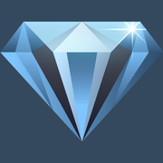

# iPhone Apps

A Portfolio of iPhone Apps heavily based on the [Udemy Course](https://www.udemy.com/course/ios11-app-development-bootcamp/)

## 01-I Am Rich

  

This app shows an image of a diamond which makes you feel rich for some reason.

## 02-I Am Poor

  

For our not so rich friends, we have the app I Am Poor. Once it loaded you will see a nice piece of coal that
might reflect the value of your bank account :(

## 03-Dicee

  

Dicee is an application that can help you rolll your dice. Tap the "Roll" button or shake your iPhone to roll them dice. 

## The apps in this repo were created using the following hardware and software:

### **Hardware**

Macbook Pro with Retina Display (late 2012 release)

iPhone 11 Model Number A211 with Software Version 13.4.1

### **Software**

Operating Sytem: macOS Catalina version 10.15.4
XCode Version 11.4.1 

